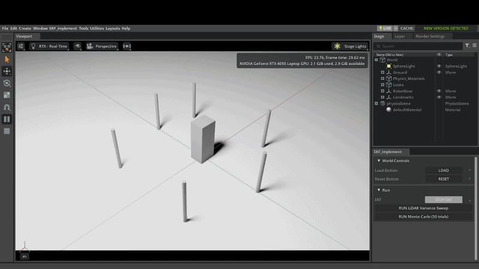

# EKF Extension

This folder contains a custom Isaac Sim extension named **EKF_implement**. It demonstrates basic robot modelled as non homogenous cuboid equipped with a 2D LiDAR, and it's Localization capabilities using landmark based EKF estimation technique.  

## Demo


## What is in this folder
This extention is built on the standard scripting template provided by Omniverse 

- `config/extension.toml` — extension metadata, dependencies, and module registration.
- `src/` — extension Python source code:
  - `extension.py` — Omniverse extension entrypoint and window lifecycle.
  - `ui_builder.py` — UI buttons and callbacks (Load/Reset/Run EKF, LiDAR sweep, Monte Carlo).
  - `simulation.py` — scene + EKF scenario wiring.
  - `ekf.py` — EKF logic implementation.
  - `analysis.py` — output/statistics helpers.
  - `mc_headless.py` — headless Monte Carlo runner logic(optional standalone file).
  - `global_variables.py` — extension title/description constants.
- `docs/` — template docs/changelog.
- `data/` — extension icon/preview assets.

## Clone from GitHub

From the Isaac Sim workspace root (`c:\isaac-sim`) in PowerShell:

```powershell
cd .\extsUser
git clone https://github.com/wintershere/pacerobotics_assignment.git ekf
cd ..
```

## How to run

From the workspace root (`c:\isaac-sim`) in PowerShell, Clone the repo into `\extsUser`:
git clone

1. Start Isaac Sim and load this extension:

```powershell
.\isaac-sim.bat --ext-folder .\extsUser --enable EKF_implement
```

2. In Isaac Sim, open the extension window from the menu entry **EKF_implement**.
3. Typical flow in the extension UI:
   - Click **LOAD**
   - Click **RUN EKF** (and **STOP EKF** when done) outputs plots take a couple of seconds to be generated
   - Optional: run **LiDAR Variance Sweep** or **Monte Carlo**


## Output 

All EKF plots/artifacts now available in:

- `OUTPUT_ROOT_DIR`

Default behavior:

- Uses env var `EKF_OUTPUT_DIR` if set.
- Otherwise falls back to: `extsUser/ekf/outputs` (inside this extension folder).

Check Technical Report for detailed Output analysis
